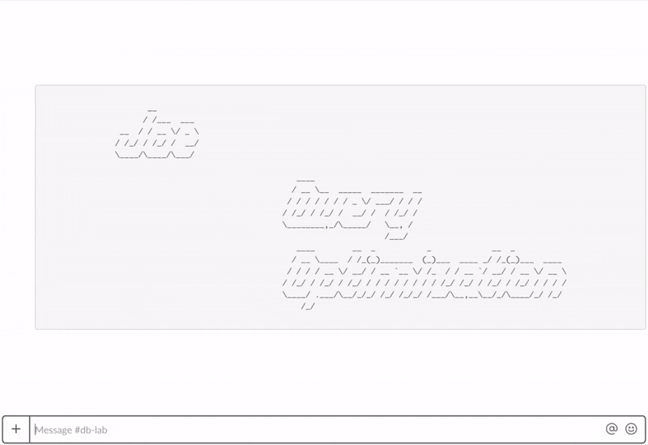

# Joe - Postgres Query Optimization
Boost your backend development process

    

Provide developers access to experiment on automatically provisioned
production-size DB testing replica. Joe will provide recommendations
for query optimization and the ability to rollback.

## Install Software

### 1. Build
*Currently, there are no ready-to-use binaries or a Docker image. The setup
is to be done using the source code.*

1. Get the source code: `git clone https://gitlab.com/postgres-ai/joe.git`.
1. It is not recommended to use HTTP: all the traffic from Slack to Joe should
be encrypted. It can be achieved by using NGINX with a free Let's Encrypt
certificate (Ubuntu: https://gitlab.com/postgres-ai/joe/snippets/1876422).
1. Golang is required.
    - Ubuntu: In some cases, standard Ubuntu package might not work. See
https://gitlab.com/postgres-ai/joe/snippets/1880315.
    - On macOS: `brew install golang`
1. Run `make all` in the project directory.

### 2. ZFS Store
1. If needed (when working in "local" mode), install ZFS (Ubuntu:
https://gitlab.com/postgres-ai/joe/snippets/1880313).
1. Create a ZFS store with a clone of
the production Postgres database (e.g. using WAL-E, WAL-G or Barman archive).
1. Shutdown Postgres, create a new ZFS snapshot
(`sudo zfs snapshot -r  zpool@db_state_1`) and remember its name. It will
be needed for further configuration (`initialSnapshot` option in 
`config/provisioning.yaml`).
1. Start Postgres.

### 3. Slack App
Configure a new Slack App in order to use Joe in Slack and add the app to your
team Workspace. Joe Bot should be available with public URL calls from Slack.
1. Create "#db-lab" channel in your Slack Workspace (You can use another channel name).
1. [Create a new Slack App](https://api.slack.com/apps?new_app=1).
    * Use "Joe Bot" as App Name and select a proper team Workspace.
1. Add Bot User.
    * Use "Joe Bot" as Display Name and "joe-bot" as the default username.
1. Run Joe Bot with `Bot User OAuth Access Token ("xoxb-TOKEN")` from "OAuth & Permissions" Feature and `Verification Token` from "Basic Information" page (See **Deploy** below).
1. Enable Incoming Webhooks Feature.
    * Press "Add New Webhook to Workspace" and select a previously created channel to post token.
1. Enable Event Subscriptions Feature.
    * Specify Request URL (URL will be verified by Slack API) (e.g. http://35.200.200.200:3000, https://joe.dev.domain.com). You would need to run Joe with proper settings before you could verify Request URL.
    * * Add `app_mention` and `message.channels` to "Subscribe to Bot Events".
1. Invite "Joe Bot" to "#db-lab" channel.

### 4. Run
Deploy Joe instance in your infrastructure. You would need to:
1. Create `config/provisioning.yaml` and `config/envs/MY_ENV.sh` with desired configuration (see samples in corresponding directories).
1. Make a publicly accessible HTTP(S) server port specified in the configuration for Slack Events Request URL.
1. Build and run Joe `ENV=MY_ENV bash ./do.sh run` (or, with log: `ENV=MY_ENV bash ./do.sh run 2>&1 | tee -a joe.log`).

Unless being run in the "local" mode, Joe will automatically provision AWS EC2
or GCP GCE instance of Postgres.

Privileged `postgres` user is required to run Joe in "local" and "mulocal" modes.
