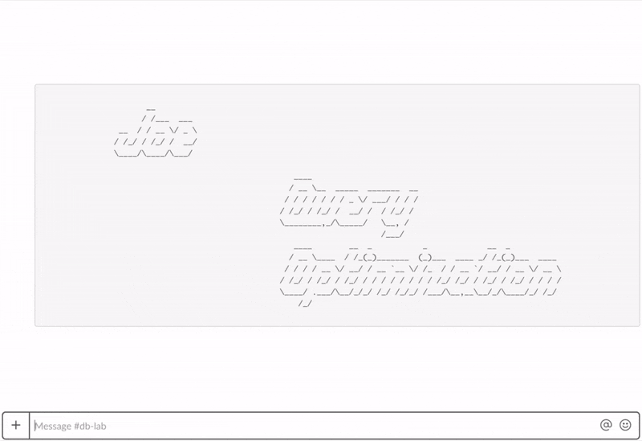

# Joe - Postgres Query Optimization
Boost your backend development process

Provide developers access to experiment on automatically provisioned
production-size DB testing replica. Joe will provide recommendations
for query optimization and the ability to rollback.

## Status

The project is in its early stage. However, it is already being extensively used
in some teams in their daily work. Since production is not involved, it is
quite easy to try and start using it.

Please support the project giving a GitLab star (it's on [the main page](https://gitlab.com/postgres-ai/joe),
at the upper right corner):

## Installation
Follow the [tutorial](https://postgres.ai/docs/tutorials/joe-setup) to install Joe Bot and start using it for PostgreSQL query optimization

## Development
See our [GitLab Container Registry](https://gitlab.com/postgres-ai/joe/container_registry) for develop builds. 

### Development tools
- [`cmd/explainrender`](./cmd/explainrender) — converts `EXPLAIN (FORMAT JSON)` into PostgreSQL's standard text plan via `pkg/pgexplain` (the JSON→text translation Joe uses because psql can't convert a JSON plan back to text). Handy for debugging that translation and diffing it against PostgreSQL's own text `EXPLAIN` across versions.

## Community

Bug reports, ideas, and merge requests are welcome: https://gitlab.com/postgres-ai/joe

To discuss Joe, [join our community Slack](https://slack.postgres.ai/)
